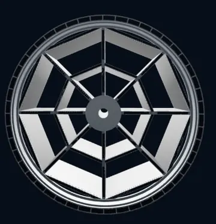
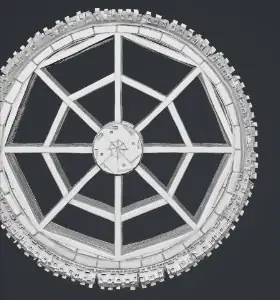
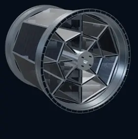
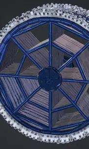
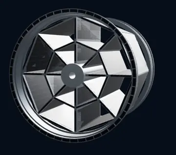
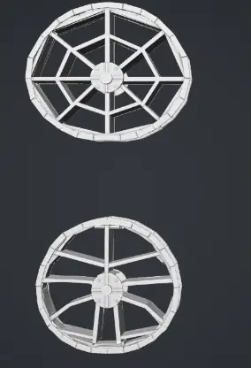
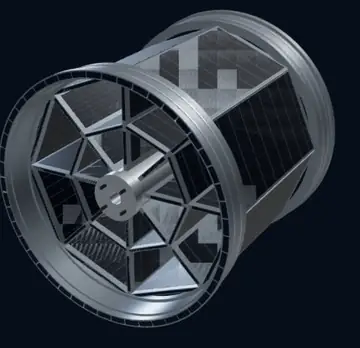
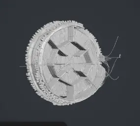
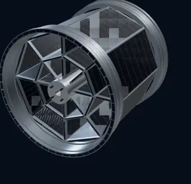
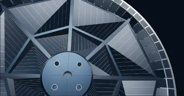

# Astra-assisted WORLDIFACT vs Meshy: a photovoltaic rim case study

*Field notes from the WORLDIFACT project, 21 September 2026.*

**Our visual assessment:** the supplied WORLDIFACT previews have cleaner-looking repeated members and a more orderly assembled appearance than several of the supplied Meshy results. However, the strongest untextured Meshy example also preserves clearly visible openings. These screenshots do not establish an overall model winner, exact engineering fidelity, or manufacturing readiness.

The useful question is not simply which wheel looks more impressive. It is whether a generator preserves the intended structure, including the spaces where there must be no material.

## Screenshot gallery

**Ten real screenshot crops, not AI-redrawn comparison posters.** Click any image to open its repository file. These are five WORLDIFACT captures, one earlier FORGE capture and four Meshy captures, not ten independent generation trials. The original model pixels were not retouched: the only transforms are viewport cropping, resizing and WebP compression.

The two columns group the workflows for inspection; rows are not matched-camera, matched-scale or before/after pairs. The strongest supplied Meshy openwork example is included alongside the other supplied results. Neither gallery position nor image size is a quality score.

<table>
<tr><th>WORLDIFACT / Astra-assisted workflow</th><th>Meshy</th></tr>
<tr>
<td valign="top"> <strong>A01 — Front view</strong> Radial members and polygonal supports. Bright broad faces still need inspection.</td>
<td valign="top"> <strong>M03 — Open untextured result</strong> A stronger Meshy example with visible open regions; not a verified through-opening pass.</td>
</tr>
<tr>
<td valign="top"> <strong>A03 — Opposite-side oblique view</strong> The assembled depth and the opposite side of the hub are visible.</td>
<td valign="top"> <strong>M01 — Blue textured result</strong> Materials and broad panel-like regions. The original viewport already clips the right-hand edge.</td>
</tr>
<tr>
<td valign="top"> <strong>A02 — Front oblique view</strong> Another angle of the WORLDIFACT preview, not evidence of a separate successful generation.</td>
<td valign="top"> <strong>M02 — Separated rim-like parts</strong> The supplied viewport shows two separated parts; the reason for separation is unknown.</td>
</tr>
<tr>
<td valign="top"> <strong>A05 — Side and barrel view</strong> Depth, connecting members and panel placement; exact geometry remains unverified.</td>
<td valign="top"> <strong>M04 — Irregular result</strong> A less orderly supplied preview with thin protruding details; cause and failure rate are unknown.</td>
</tr>
</table>

### Additional context — not additional independent trials

<table>
<tr><th>Current WORLDIFACT interface</th><th>Earlier FORGE view</th></tr>
<tr>
<td valign="top"> <strong>A04 — WORLDIFACT Shop context</strong> Preview and visible mode controls. Current controls alone do not prove the displayed artifact's generation settings.</td>
<td valign="top"> <strong>F01 — Earlier FORGE detail</strong> Historical close-up, not Meshy and not an additional current WORLDIFACT generation. The source viewport clips the model.</td>
</tr>
</table>

Phone/browser bars, account controls and unrelated reference thumbnails have been excluded from the published crops. The uncropped screenshots and underlying design documents remain unpublished. Source identifiers map to the [original screenshot manifest](evidence/RIM_REVIEW_2026-09-21.json); published image dimensions, source hashes and Git blob identifiers are in the [public crop manifest](evidence/rim-review-2026-09-21/manifest.json). Three existing blog crops are reused byte-for-byte as A03, M01 and M03; the other seven crops extend the GitHub gallery. The earlier crop-reproduction metadata was not recovered for all seven additional files; the manifest records that limitation. The generated promotional posters from the conversation are not used as evidence.

**Evidence boundary:** these are real captures of generated 3D previews, not real-world photographs of a manufactured rim. Raw meshes, complete job traces, matched inputs and fabrication validation remain unavailable in this review.

## What we reviewed

The inventor supplied ten screenshots: five current WORLDIFACT Shop views, one earlier FORGE view, and four Meshy views. Their identifiers, filenames and SHA-256 hashes are recorded in the [evidence manifest](evidence/RIM_REVIEW_2026-09-21.json). References such as A01 and M03 below refer to that manifest.

This is an owner-supplied, qualitative case study written from the WORLDIFACT project perspective, not an independent benchmark. Several captures may show the same asset. We do not know the number of generation attempts, which outputs were omitted, or whether the two systems received identical inputs. We reviewed screenshots, not the corresponding GLB/STL files, UV maps or generation logs. The uncropped originals remain private because they include browser/account interface details. All ten captures now have public viewport crops in the gallery above; this supports visual inspection but does not make the generation experiment independently reproducible.

The project source was inspected at commit [`cdfb2870da1a34f324235d2435c3e44b3db1bb30`](https://github.com/teslaeco/WORLDIFACT/commit/cdfb2870da1a34f324235d2435c3e44b3db1bb30). No paid generation was initiated for this review.

## The target: an open structural rim, not a decorative disk

The target is the inventor's photovoltaic land-vehicle rim concept, described in the supplied `opis.felga.17.07.2025.docx` and referenced by the drawing thumbnails in the screenshots. For the illustrated eight-arm embodiment, the supplied description specifies eight main load-bearing arms (6a), eight larger support members (6b) and eight smaller support members (6c), together with the flange assemblies and hub structure. This describes the selected example; it is not a claim that every possible embodiment must have exactly eight members.

The owner's essential acceptance condition is preservation of the designated open spaces between structural members. Those spaces must not become caps, membranes or photovoltaic panels merely to make a surface look continuous. Conversely, legitimate structural faces and photovoltaic mounting surfaces must not be removed just because they look broad in one projection. Exact acceptance requires the original drawings, part correspondence and an inspectable mesh. This review does not determine patent grant status or legal scope, and does not republish the underlying documents.

## What the screenshots show

| Criterion | WORLDIFACT / FORGE evidence | Meshy evidence | Assessment |
|---|---|---|---|
| Repeated structural members | A01-A05 show straight-looking radial members, orderly polygonal supports and smooth-looking rim outlines. | M03 shows a recognizable open framework; M01 and M04 have visibly rougher or less orderly regions. | A provisional visual advantage for WORLDIFACT in regularity, not proof of dimensional accuracy. |
| Intended empty spaces | Dark gaps are visible, but bright broad surfaces and opposite-side surfaces make some regions ambiguous. | M03 has clearly visible openings; M01 and M04 contain regions whose depth or obstruction cannot be resolved from the capture. | Neither receives a verified through-opening pass. Meshy's successful openwork example must be acknowledged. |
| Assembly | A02-A05 present an apparently assembled rim with depth visible from several angles. | M02 displays two separated rim-like parts; M03 displays a single apparent assembly. | M02 is not the requested assembled presentation, but it does not establish that Meshy always splits the object. |
| Surface appearance | The supplied WORLDIFACT views read as comparatively orderly metal/PV surfaces, with very bright and striped areas that still need inspection. | M01 has a strong blue material treatment, but also visually busy surface and perimeter detail. | Appearance is partly subjective. Different lighting, materials and camera views prevent a controlled texture comparison. |
| Exact reference fidelity | Hub details, depth, internal connections and all required openings remain unverified. | The same checks remain unverified. | No engineering-fidelity winner can be declared. |

### Where WORLDIFACT looks stronger

For this particular reference-driven mechanical object, the supplied WORLDIFACT views make the repeated structure easier to read. The front view A01 and oblique views A02-A05 show a relatively organized relationship between the rim, hub and radial members. That makes them a promising starting point for a geometry review.

This is an assessment of the supplied previews, not a measurement of surface error. It also does not demonstrate repeatability: five views of one successful model are not five successful generations.

### Where Meshy deserves credit

M03 is important counter-evidence to an overly favorable WORLDIFACT story. Its untextured rim visibly preserves substantial open regions and an identifiable structural pattern. It would be misleading to compare our strongest view only against Meshy's roughest result and conclude that Meshy cannot create open structures.

M02 shows separated parts and M04 shows irregular, thread-like details. These are limitations of those displayed results relative to the desired assembled presentation. We cannot infer their cause, frequency, or whether subsequent editing would resolve them. M01's blue textured appearance is a different stage and should not be treated as a geometry-only comparison with M03.

### Where our own output still needs work

The broad reflective areas in the WORLDIFACT images require inspection. A bright patch may be an intended structural surface, an opposite-side part, an unwanted face, or a rendering artifact. A dark patch may look empty without proving that the exported geometry is open. Screenshots cannot settle those alternatives.

The hub and its mounting openings must also be compared with the correct reference side. Opposite-side views are not interchangeable. We have not verified the internal connections, wall thickness, tire-seat geometry, scale, or the completeness of the photovoltaic layout. We therefore do not describe the current result as an exact replica or a finished manufacturing model.

## What “Astra vs Meshy” means here

The fair comparison is **an Astra-assisted WORLDIFACT workflow versus the Meshy workflow**, rather than a claim that two isolated foundation models directly produced equivalent mesh files under identical conditions.

The inspected [Shop source](https://github.com/teslaeco/WORLDIFACT/blob/cdfb2870da1a34f324235d2435c3e44b3db1bb30/src/pages/ShopPage.tsx) separates two paths. FAST requests a validated Astra blueprint and displays a lightweight procedural draft. SLOW submits a detailed Studio job and retrieves a model artifact; the project documents that path as Oracle/Blender. The selected SLOW control in A04 does not, by itself, establish the complete provenance of the displayed rim. The UI explicitly allows editing the next description while the current preview stays unchanged, so current controls and references are not a substitute for the submitted job record.

OpenAI's official model guide specifies `gpt-6-astra` for the Responses API and describes structured outputs and tool-supported workflows.[1] That supports the integration description, not attribution of every vertex in these screenshots to that model. Per-artifact provider/model logs, worker revision and artifact hashes are still needed.

The Meshy screenshots display a Meshy 7.1 label. Meshy's official API documentation describes multi-image geometry generation and separate texturing inputs.[2] A UI label is evidence of what was displayed, not an independently verified backend revision for every selected result.

## Important limits in this comparison

**Input equivalence is unknown.** The original uncropped A04 shows three reference images, including drawing sheets and a rendered view, with view selectors set to “other.” Meshy's captures also show multiple references, but neither image-byte identity nor the exact submitted settings are available. The visible WORLDIFACT instructions are extensive; we do not have an equivalent complete Meshy submission record.

**Drawing sheets are a possible confounder.** Meshy's guidance expects views of the same object from different angles.[2][3] A whole sheet containing several figures, labels or an exploded view is not equivalent to a clean single-object view. Such inputs could contribute to ambiguity, but we have not established that they caused any particular result. A future comparison should separate a realistic “drawing sheets as supplied” task from a normalized-view task rather than quietly changing the test after seeing an unfavorable output.

**Geometry and texture resolution are different.** Meshy's documentation distinguishes geometry resolution from texture resolution.[2] An Ultra 2K geometry setting, a 2K texture selection and WORLDIFACT's “up to 4K” label are not equivalent measurements. We did not inspect the exported texture dimensions. Likewise, the Meshy UI's million-scale face counts are not evidence that it is more accurate, and we did not measure the corresponding WORLDIFACT count.

**Speed, cost and reliability were not measured.** Clock times, estimated task durations, credit balances and selected successful previews cannot establish latency, total spend or success rate. No speed multiple, price advantage, percentage improvement or numerical quality score is claimed.

**A printability badge is not reference validation.** Even a mesh that can be sliced may reproduce the wrong object. An intended through-opening is not a broken mesh hole that should automatically be filled. Fabrication suitability also depends on scale, material and process. Neither a screenshot nor a preview/export button establishes those checks.

## Our conclusion

For the rim shown here, **we prefer the supplied WORLDIFACT result as a starting point for controlled geometry refinement because its repeated structure looks cleaner and easier to inspect.** That preference is provisional and specific to this example. Meshy's best supplied untextured result is a credible openwork result, and the evidence does not justify a universal “Astra beats Meshy” claim.

Neither workflow has yet been shown, in this review, to reproduce the original rim exactly or to deliver a validated manufacturing asset. The next meaningful improvement is not extra shine or a larger polygon count. It is proving that the correct members exist, the required spaces remain empty, and the exported model matches the intended assembly.

## Next evaluation — proposed, not performed

A stronger follow-up should predefine the target and acceptance criteria, then preserve every attempt from both workflows. Record the input-image hashes, complete supported prompts, model/profile versions, settings, elapsed time, actual cost, manual corrections and output hashes. Keep the same reference information available to both workflows and explicitly disclose differences in their supported input interfaces.

Review the resulting meshes under the same camera, scale and neutral material before judging textures. Check required part counts and connections; compare the front, back and side with the corresponding references; and inspect cross-sections and visibility through each designated open region. Then evaluate normals, intersecting/disconnected surfaces and process-specific minimum features. A watertightness check must preserve intentional tunnels rather than cap them. Texture review should follow on the approved geometry, using actual map dimensions and comparable lighting.

**GAME:** visual candidate; exported-mesh and runtime quality remain unverified in this review. **MAKE:** VALIDATION REQUIRED; no production approval, quote or order is implied.

We welcome technical feedback on the geometry and evaluation method, including corrections to this assessment.

## Sources and evidence boundaries

1. [OpenAI — Model guidance](https://developers.openai.com/api/docs/guides/latest-model), accessed 21 September 2026. Used for the official model identifier and integration capabilities, not comparative mesh quality.
2. [Meshy — Multi-Image to 3D API](https://docs.meshy.ai/en/api/multi-image-to-3d), accessed 21 September 2026. Used for input-view guidance and the distinction between geometry and texture parameters, not as evidence of our test outcomes.
3. [Meshy — How to Use Multi-View](https://help.meshy.ai/en/articles/12634481-how-to-use-multi-view), accessed 21 September 2026. Workflow guidance, not a benchmark result.
4. [Pinned WORLDIFACT Shop implementation](https://github.com/teslaeco/WORLDIFACT/blob/cdfb2870da1a34f324235d2435c3e44b3db1bb30/src/pages/ShopPage.tsx) and [contemporaneous project ledger](https://github.com/teslaeco/WORLDIFACT/blob/cdfb2870da1a34f324235d2435c3e44b3db1bb30/docs/CONTEST_STATUS.md). Source-level architecture and historical records do not substitute for a per-rim generation trace.
5. [Owner-supplied screenshot manifest](evidence/RIM_REVIEW_2026-09-21.json). Visual observations in this article derive from those owner-supplied captures. The [public screenshot gallery](#screenshot-gallery) and [crop manifest](evidence/rim-review-2026-09-21/manifest.json) now provide the image appendix. Uncropped originals, raw model files and complete generation records remain unpublished or unavailable.
