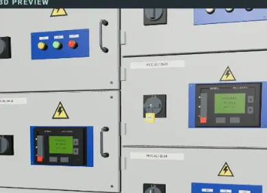
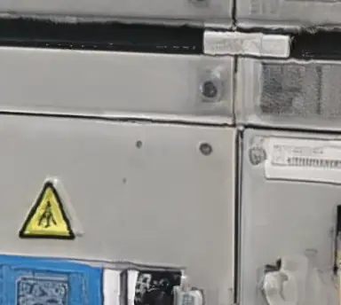

# MCC case study: WORLDIFACT / owner-reported Astra vs Meshy 7.1

[Public comparison page](https://worldifact.xodobrox.workers.dev/compare/mcc/). Review date: 29 September 2026. This is the maker's assessment of one owner-selected example, not an independent benchmark.

| WORLDIFACT detail | Meshy detail |
| --- | --- |
|  |  |

## Fair assessment

For functional readability of the shown MCC front, we prefer the supplied WORLDIFACT result: screens, blue plates, pilot lights, rotary controls and panel divisions are visually clearer. The Meshy output retains a recognizable cabinet lineup and more photographic-looking surface variation; several small controls and openings appear softer or smeared in the supplied close-ups. WORLDIFACT's surfaces are cleaner but more uniform and repeated, which can look synthetic. These are observations about appearance in the supplied images, not proof of editable components, correct electrical design or exact physical reconstruction.

## Measured versus unknown

- **Screenshot-reported:** Meshy 7.1 selected; Ultra 2K mode; 654,626 triangular faces; 385,562 vertices on the first result and 385,435 on another selected item. This is UI evidence, not a mesh independently parsed by WORLDIFACT.
- **Screenshot-reported:** WORLDIFACT gallery shows a 39.6 MB GLB marked UNREVIEWED and three reference images. The owner attributes the generation to Astra. No per-job signed model receipt was attached in this comparison.
- **Unknown:** WORLDIFACT triangle count; actual texture sizes, normals, UV quality, exact material/export contents, watertightness, time, API cost and identical input conditions for both products. We cannot award a polygon-density victory to either side.
- **Important:** Meshy Ultra 2K is a geometry setting, not a measured 2K texture. The WORLDIFACT prompt's request for 4K PBR is not proof that 4K textures were produced. A printability badge is not engineering approval.

## Limits and disclosure

The maker and owner selected the evidence; camera, lighting, zoom and inputs are not matched. The historical good Astra cabinet is distinct from the later failed cost-capped live test in [issue #140](https://github.com/teslaeco/WORLDIFACT/issues/140). Do not use these photos to claim that the new budget policy is live-verified or that Astra always beats Meshy.

Only viewport crops are published, without user identity, balance, browser tabs or unrelated gallery images. The same WebP quality 72 was used; no sharpening, AI enhancement, relighting or model edit was applied. [Provenance manifest](../public/comparisons/mcc/provenance.json) records source names, original hashes, crop rectangles and derivative hashes. Screenshots and third-party visual/interface material are not relicensed under MIT; rights remain with the respective owners. Publication was explicitly requested for this comparison.

## Better access without misleading claims

Luna 15 / Sol 50 / Astra 250 points are product prices, not literal token-price ratios. Hosting, storage, exports, risk and funding reserves also matter. Free users share the same procedural material and MCC component quality rather than receiving intentionally degraded surfaces. A compact kit can preserve readable controls without asking a cheap model to output hundreds of meshes. It is not claimed to equal Meshy image reconstruction or a detailed Astra asset.

Official sources reviewed on 29 September 2026:
- https://developers.openai.com/api/docs/models/gpt-6-astra
- https://developers.openai.com/api/docs/models/gpt-6-sol
- https://developers.openai.com/api/docs/models/gpt-6-luna
- https://docs.meshy.ai/en/api/multi-image-to-3d

## Controlled follow-up protocol

For a publishable benchmark, use the same original reference set and brief, equal declared budgets, fixed model versions, all attempts including failures, identical cameras/light, and actual files. Measure silhouette alignment, device counts and readability, topology, UV/PBR map sizes, file sizes, success rate, elapsed time and settled cost. Review unlabeled renders where practical. No new paid benchmark was run for this report.
